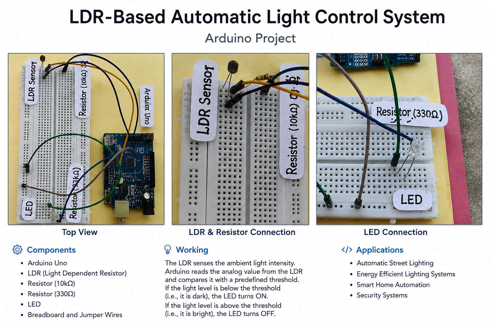

# LDR-Based Automatic Light Control System

## 📌 Project Overview

This project is an Arduino-based automatic light control system using an LDR (Light Dependent Resistor) sensor.

The system detects the surrounding light intensity through the LDR sensor and automatically controls an LED based on a predefined light threshold.

## ⚙️ How It Works

The LDR is connected to the analog input pin A0 of the Arduino Uno.

The Arduino continuously reads the light intensity using `analogRead()` and compares the sensor value with a predefined threshold of 70.

- When the sensor value is **70 or below**, the LED is turned **ON**.
- When the sensor value is **above 70**, the LED is turned **OFF**.

This allows the LED to respond automatically to changes in surrounding light conditions.

## 🧰 Components Used

- Arduino Uno
- LDR (Light Dependent Resistor)
- LED
- 10 kΩ Resistor
- 330 Ω Resistor
- Breadboard
- Jumper Wires

## 💻 Technologies & Tools

- Arduino
- C/C++
- Arduino IDE
- Analog Sensor Reading
- Digital Output Control

## 🔌 Pin Configuration

| Component | Arduino Pin |
|-----------|-------------|
| LDR | A0 |
| LED | Digital Pin 7 |

## 🚀 How to Run

1. Open `LDR_Automatic_Light_Control.ino` in the Arduino IDE.
2. Connect the LDR and LED according to the circuit.
3. Connect the Arduino Uno to your computer.
4. Select the appropriate Arduino board and COM port.
5. Upload the code to the Arduino.
6. Open the Serial Monitor at **9600 baud** to observe the sensor readings.
7. Change the surrounding light intensity and observe the LED response.

## 📊 Result

The system successfully reads light intensity using an LDR sensor and automatically switches the LED according to the predefined threshold.

## 🔮 Future Scope

- Control multiple lights automatically.
- Add a relay module to control higher-power lamps.
- Add an LCD/OLED display for real-time light intensity.
- Integrate IoT functionality for remote monitoring and control.

## 👩‍💻 Project Contribution

This project was developed as a practical Arduino and sensor-based project. I worked on the implementation and documentation of the project.

## 📁 Project Files

- `LDR_Sensor.ino` — Arduino source code
- `project-preview.png` — Project preview image

## 📌 Author

**Neha**

GitHub: [Neha-ECE](https://github.com/Neha-ECE)
